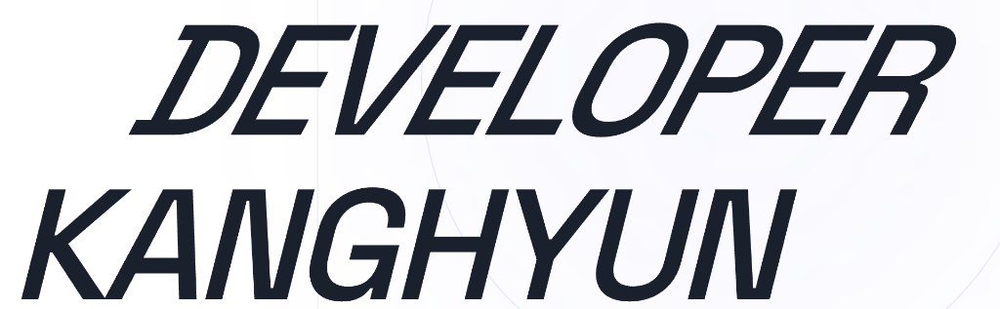

  

 

# 👨🏻‍💻 안녕하세요, 상상을 코드로 그려내는 개발자 김강현입니다.

> *"빠른 속도로 발전하는 새로운 기술 동향 파악과 기술 학습을 두려워하지 않으며, 픽셀 단위의 작은 차이까지 신경 쓰는 꼼꼼함으로 디테일이 살아있는 높은 완성도를 만듭니다."*

 

## 🧭 My Engineering Philosophy
**기술을 통해 사용자에게 즐거움과 가치를 제공하고자 합니다.**
- **견고한 아키텍처**: 겉보기에만 화려한 앱이 아니라, 클린 아키텍처(Clean Architecture)와 FSD(Feature-Sliced Design)를 고민하며 비즈니스 로직과 UI 영역을 명확히 분리합니다.
- **테스트 주도 개발**: TDD 기반의 개발(Red-Green-Refactor)을 통해 코드의 무결성을 증명하고, 유지보수하기 좋은 구조를 지향합니다.
- **최적화와 디테일**: 3단계 Fallback 전략, Optimistic UI 패턴 등 사용자가 조금이라도 더 빠르고 쾌적하게 느낄 수 있는 방법론을 고민하고 즉각 도입합니다.

 

## 💡 Core Competencies

### 🎨 Frontend
- **React, Next.js(App Router)** 생태계를 주력으로 다룹니다.
- **TypeScript**를 활용해 타입 안전성이 보장된 확장이 용이한 인터페이스를 구축합니다.
- 복잡한 전역 상태는 **Zustand**, 서버 상태 및 캐싱 관리는 **TanStack Query**로 명확히 나누어 관리합니다.
- 무거운 외부 라이브러리에 의존하지 않고, **Native Observer API**와 **Vanilla CSS**를 활용해 퍼포먼스를 극대화한 극한의 반응형 UI/UX를 구현하는 것을 좋아합니다.

### ⚙️ Backend & Architecture
- **NestJS**와 **Spring Boot**를 활용하여 백엔드 비즈니스 로직을 튼튼하게 설계합니다.
- **PostgreSQL**, **Redis**, **Prisma**를 다루며 효율적인 RDBMS 스키마 설계 및 캐싱 전략을 구성할 수 있습니다.

### 🚀 DevOps & Infra
- **Docker** 컨테이너 기반으로 서비스를 일관되게 패키징합니다.
- **GitHub Actions**, **AWS S3**, **Vercel** 환경을 조합하여 CI/CD 배포 파이프라인을 직접 구축하고 운영합니다.

 

## 📂 Selected Projects

| 프로젝트명 | 간략 소개 | 핵심 스택 & 기술적 하이라이트 |
| :--- | :--- | :--- |
| **[The Habit](https://github.com/developer-kanghyun/the-habit)** | PWA 기반 모바일 퍼스트 습관 트래커 | `Next.js`, `Prisma`, `PWA`  - **Clean Architecture** 전면 적용 - Web Push 알림 및 모바일 프로덕션 배포 |
| **[Interview Mate](https://github.com/developer-kanghyun/Interview-mate)** | AI 면접 연습 풀스택 플랫폼 | `Next.js 14`, `Spring Boot`, `Redis`  - **TDD (테스트 주도 개발)** 적용 - **FSD + AI Layer** 3계층 아키텍처 결합 설계 |
| **[High-Yield Trading](https://github.com/developer-kanghyun/high-yield-trading-system)** | 개발자용 주식 실시간 자동매매 시스템 | `NestJS 10`, `PostgreSQL`, `Socket.IO`  - 멀티 브로커 어댑터 패턴 추상화 개발 - 웹소켓 시세 스트리밍 실시간 처리 파이프라인 |
| **[Weather Check](https://github.com/developer-kanghyun/Weather-Check)** | 한국 지명 특화 자연어 날씨 서비스 | `React 18`, `TanStack Query`, `Tailwind`  - **3-Tier Fallback** 전략으로 지명 인식률 99% 달성 - **Optimistic UI** 패턴으로 지연율 체감 향상 |

> _이 외에도 OTT 통합 검색 최적화(Flic Flow), 공간 예약 시스템(TtaBook) 등 본 프로젝트의 `src/features/projects/Project.tsx` 탭이나 깃허브에서 더 많은 프로젝트를 확인하실 수 있습니다._

 

## 📬 Get In Touch
* 📌 **Portfolio Website**: [kanghyun.dev](https://www.kanghyun.dev) (Live)
* 📄 **Resume PDF**: [Download CV](https://www.kanghyun.dev/portfolio-2026.pdf)
* 📧 **Email**: dev.kanghyun@gmail.com
* 📝 **Tech Blog**: [dev-kanghyun.tistory.com](https://dev-kanghyun.tistory.com/)